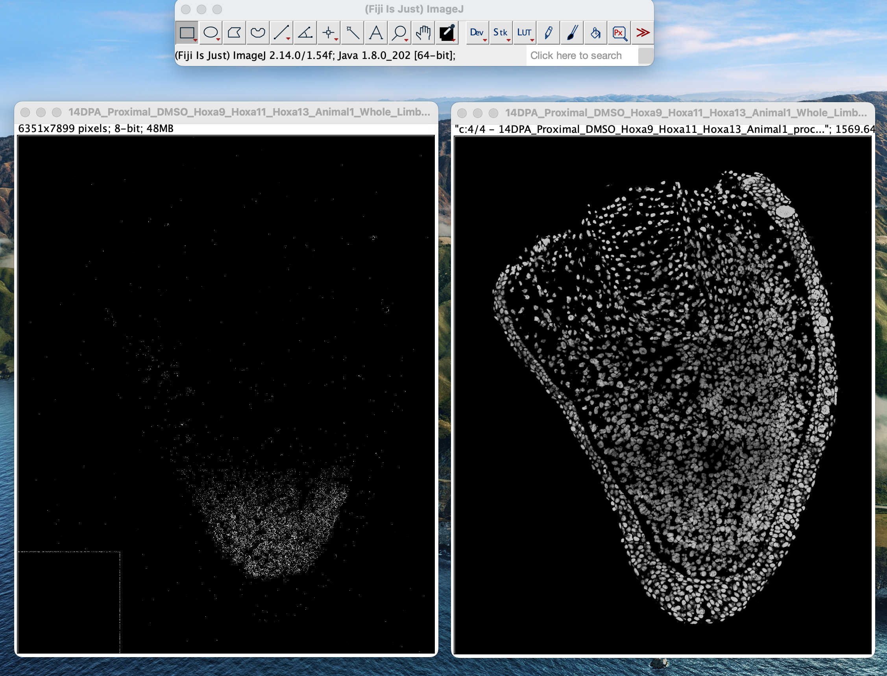
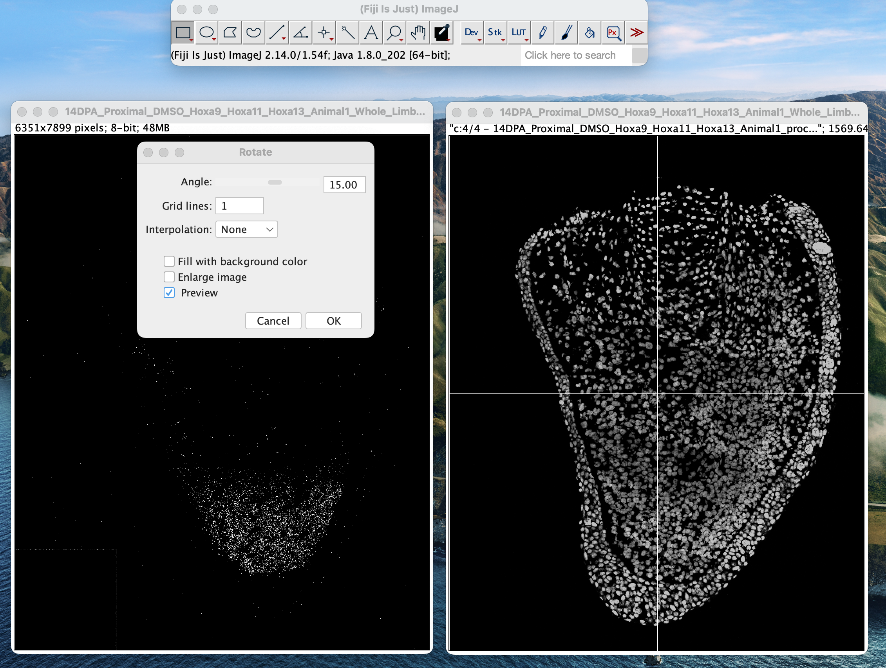
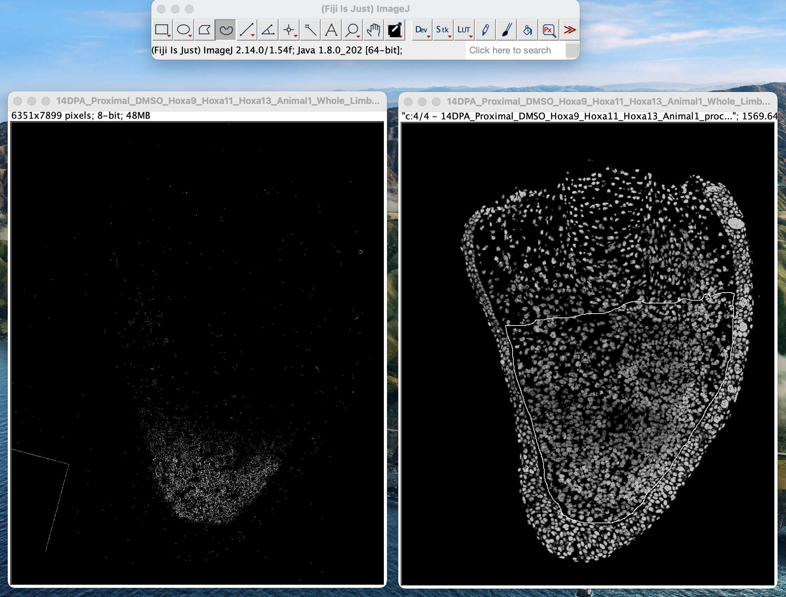
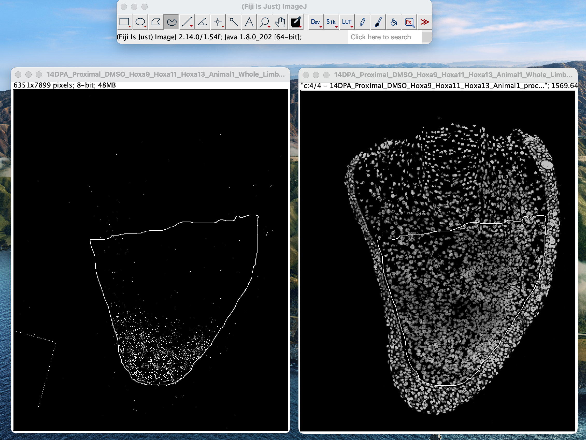
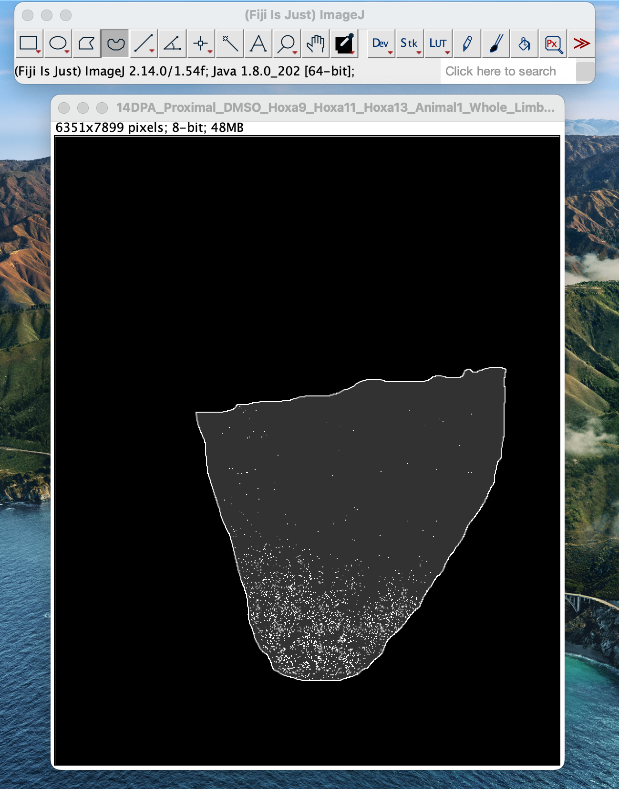

HCR-FISH expression intensity measurement
================

The goal of this pipeline is to get expression intensity measurements
along the proximo-distal axis in the mesenchyme using HCR-FISH dots
identified as single “positive” pixels.

**Some notes**: Depending on exactly the image size, each image may take
up to 10 minutes and produce an output CSV over 1 GB. Do not start
saving the results CSV until the macro is entirely finished running, as
the results page will appear before it’s actually finished. Do not close
out of the results page until it is finished saving - because these are
such large results files, it will take a few minutes.

Be sure to name your output files along the lines of
`{Timepoint}_{Condition}_{Gene}_{Replicate}.csv`, which aligns with the
naming convention default in [the provided plotting
script](./scripts/IntensityPlotting_Sample.R).

### Steps

1.  In FIJI, open both the maxima image [(generated
    here)](./RS_FISH_Analysis.md#creating-maxima-image) and
    corresponding DAPI image. Note that the maxima here have been
    dilated for visibility.

2.  Visually assess the directionality of the tissue using the DAPI
    image. The proximo-distal normalization is based on the y-axis, so
    if the tissue is very “tilted” then it may need to be adjusted. Go
    to `Image > Transform > Rotate...` and a screen will pop up. Tick
    the `Preview` box. Change the value in the `Angle` box until it is
    roughly proximal at the top, distal at the bottom.

3.  Make note of the angle chosen, and press `OK`. Then repeat the same
    rotation on the maxima image. **NOTE:** in the `Rotate` box that
    opens, set `Interpolation` to `None`.

4.  Again in the DAPI image, use the freehand tool to outline the tissue
    of interest:

5.  Select the maxima image, then go to
    `Edit > Selection > Restore Selection`.

6.  In the maxima image, go to `Edit > Clear Outside`.

7.  Use `Process > Math > Add` and add an arbitrary value greater than 0
    and less than 255 to the selection area. It doesn’t really matter
    what this value is, as long as it’s consistent between images. This
    is how the plotting script distinguishes between “in the selection”
    negative pixels and “outside of the selection” pixels. Anything that
    was 0 will now be the added value, while the positive pixels will
    remain at the maximum value, 255.

8.  After step 7 the image should look something like this, which may be
    darker or lighter inside the selection depending on the value added
    in the previous step:

9.  Run [the intensity measurement
    macro](./scripts/intensity_measurement.ijm) on this image. It will
    take a few minutes to finish.

10. When the macro finishes running, select the results page and save it
    as a `.csv`. Give it a few minutes to finish saving. The naming
    convention `{Timepoint}_{Condition}_{Gene}_{Replicate}.csv` is used
    in the [plotting script](./scripts/IntensityPlotting_Sample.R)
    provided.
