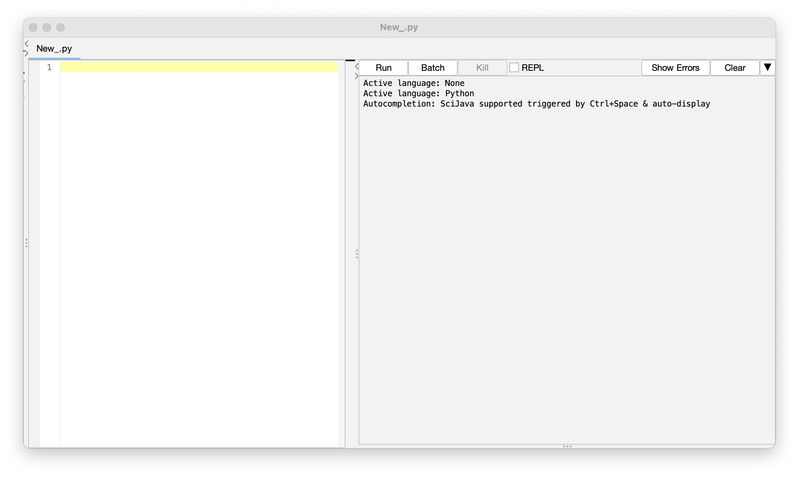

Using the ROI converter
================

- [Overview](#overview)
- [Cellpose single-image ROI
  converter](#cellpose-single-image-roi-converter)
  - [Note: an infrequent error in ROI
    conversion](#note-an-infrequent-error-in-roi-conversion)
- [Running the batch ROI converter](#running-the-batch-roi-converter)
- [What to do now](#what-to-do-now)
- [References](#references)

## Overview

This is the final step in collecting counts of dots from HCR-FISH
images. Briefly, you will use the [maxima images created in a previous
step](./RS_FISH_Analysis.md), then overlay [your segmentation result
outlines](./Cellpose_Segmentation.md) onto this image to get
measurements of the dots in each nucleus or cell.

## Cellpose single-image ROI converter

With your maxima image open in FIJI, make sure your ROI-Manager is
cleared of any previous ROIs. You can do this simply by closing the
ROI-Manager window if it is open. Open `File > New > Script...` and a
window will open like this:


Go to `Language` and make sure `Python` is selected. Now go to the
Cellpose Github page and copy-and-paste [the ImageJ ROI Converter
macro](https://github.com/MouseLand/cellpose/blob/main/imagej_roi_converter.py)
into this screen or download the file and open it in FIJI. Then click
`Run`. If all goes smoothly, you’ll be prompted to choose the text
outlines pertaining to that image. These ROIs will automatically
populate the ROI Manager and overlay onto your maxima image:


You can uncheck the `Labels` box in the ROI Manager to assess the
segmentation results more easily. If the results don’t look spectacular,
you might want to [go back and edit the segmentation
parameters](./Cellpose_Segmentation.md) you set to get these outlines.

Go to `Analyze > Set Measurements...`. You can measure whatever you
want, but what we’re interested in is `Label`, `Area` and
`Integrated density`, so make sure at least those boxes are ticked, and
hit `OK`. Then in the ROI Manager, hit `Measure`. A window will pop up
with the measurements from that image, which you should save as a `.csv`
corresponding to the original image, the gene, and the tissue.

For example, we might have
`10DPA_Distal-DMSO_Cyp26b1-Cyp26a1-Crabp2_Animal5_Crabp2_Blastema.csv`.
The raw integrated density (`RawIntDen`) for each ROI indicates how many
dots were in a given cell multiplied by 255. This is from the earlier
`Find Maxima`, when each identified FISH dot became a single pixel with
a value of 255 and “everything else” has a value of 0. You can ignore
the `IntDen` column.

#### Note: an infrequent error in ROI conversion

Occasionally when using the ROI converter, there will be an error
something like this:
`TypeError: invalid literal for int() with base 10: ''.` This is due to
some strangeness in Cellpose where one or more empty lines is
inadvertently added to the text file of outlines. To fix this error,
you’ll have to go through and manually delete the blank lines. This
won’t impact your segmentation. If you are on Mac or Linux, you can run
the command below in your command line to print out the line numbers
that are empty (first make sure you are in the folder containing your
text outlines):

``` bash
for FILE in *
  do 
    echo $FILE;
    awk '{if($0 == "") {print NR}}' $FILE
  done;
```

Then you can easily go into a text editor like Vim and find and delete
the empty lines.

## Running the batch ROI converter

The individual conversion above is useful for checking on your
segmentation parameters, as well as assessing if any “iffy” images
segmented adequately enough for their measurements to be valid. However,
as your numbers grow it can get a little tiresome, so the
Cellpose-provided ROI converter was modified a little bit to be able to
work through whole folders of maxima and outlines and automatically take
the measurements. [A copy is provided in the scripts
directory](./scripts/batch_ROI_converter.py).

When you run the batch converter, a window will pop open prompting you
to select input and output directories. The input directory should be
the directory containing both the `_Maxima.tif` images and
`_cp_outlines.txt` segmentation text outlines. The output directory
should be an empty (or not, but it will overwrite any existing results
files if they match in name) directory where all of the measurements
files will populate.

There are a few things in the batch converter that you will need to edit
for your personal use:

- At line 13, change the `tissues` list to reflect your (`-` separated
  single-string) regions of interest. This might instead be something
  like `("Ventral-Mesenchyme", "Distal", "Proximal-Nail")`.
- At line 15, the `stain` should be the one used for the given image and
  outlines, such as WGA or GFP. If your stain is multiple words, again
  connect them with a `-`.
- If you are running on Windows, you may need to change the `/` in line
  47 to `\`.

Some things to make sure of before running the batch converter:

- All maxima images should be named with this format:
  - `{Other_Identifying_Information}_Whole-Tissue_{Gene}_Maxima.tif`
- All outline text files should be named with this format:
  - `{Other_Identifying_Information}_{Tissue}_{Stain}_cp_outlines.txt`

In our case, we have two separate conditions, days post amputation and a
drug treatment. We also do three-gene FISH with a DAPI nuclear stain,
and have multiple biological replicates. So an example for ours might
be:

- `14DPA_Distal-DMSO_Hoxa9-Hoxa11-Hoxa13_Animal1_Whole-Tissue_Hoxa9_Maxima.tif`
- `14DPA_Distal-DMSO_Hoxa9-Hoxa11-Hoxa13_Animal1_Blastema_DAPI_cp_outlines.txt`

This pairing will measure the dots/transcripts of Hoxa9 that were
identified specifically in the limb blastema. The batch converter loops
through your directory of maxima images and text outlines, matches each
outlines file to its respective maxima image, and takes the
measurements. It then outputs a `.csv` results file in your selected
output folder that is named to reflect the input maxima and outlines.
With the above maxima and outlines, for example, the batch converter
will output
`14DPA_Distal-DMSO_Hoxa9-Hoxa11-Hoxa13_Animal1_Hoxa9_Blastema.csv`.

## What to do now

After getting all of your measurement files, you are ready to put all of
your data together for visualization and charting. This is done entirely
in R, and [a walkthrough is
provided](./Data_Concatenation_Walkthrough.Rmd). You will need to
download this file and open it in RStudio.

## References

<div id="refs" class="references csl-bib-body hanging-indent">

<div id="ref-RN149" class="csl-entry">

Choi, Harry M. T., Maayan Schwarzkopf, Mark E. Fornace, Aneesh Acharya,
Georgios Artavanis, Johannes Stegmaier, Alexandre Cunha, and Niles A.
Pierce. 2018. “Third-Generation in Situ Hybridization Chain Reaction:
Multiplexed, Quantitative, Sensitive, Versatile, Robust.” Journal
Article. *Development* 145 (12): dev165753.
<https://doi.org/10.1242/dev.165753>.

</div>

<div id="ref-RN152" class="csl-entry">

Pachitariu, Marius, and Carsen Stringer. 2022. “Cellpose 2.0: How to
Train Your Own Model.” Journal Article. *Nature Methods* 19 (12):
1634–41. <https://doi.org/10.1038/s41592-022-01663-4>.

</div>

<div id="ref-RN150" class="csl-entry">

Schindelin, Johannes, Ignacio Arganda-Carreras, Erwin Frise, Verena
Kaynig, Mark Longair, Tobias Pietzsch, Stephan Preibisch, et al. 2012.
“Fiji: An Open-Source Platform for Biological-Image Analysis.” Journal
Article. *Nature Methods* 9 (7): 676–82.
<https://doi.org/10.1038/nmeth.2019>.

</div>

<div id="ref-RN151" class="csl-entry">

Stringer, Carsen, Tim Wang, Michalis Michaelos, and Marius Pachitariu.
2021. “Cellpose: A Generalist Algorithm for Cellular Segmentation.”
Journal Article. *Nature Methods* 18 (1): 100–106.
<https://doi.org/10.1038/s41592-020-01018-x>.

</div>

</div>
