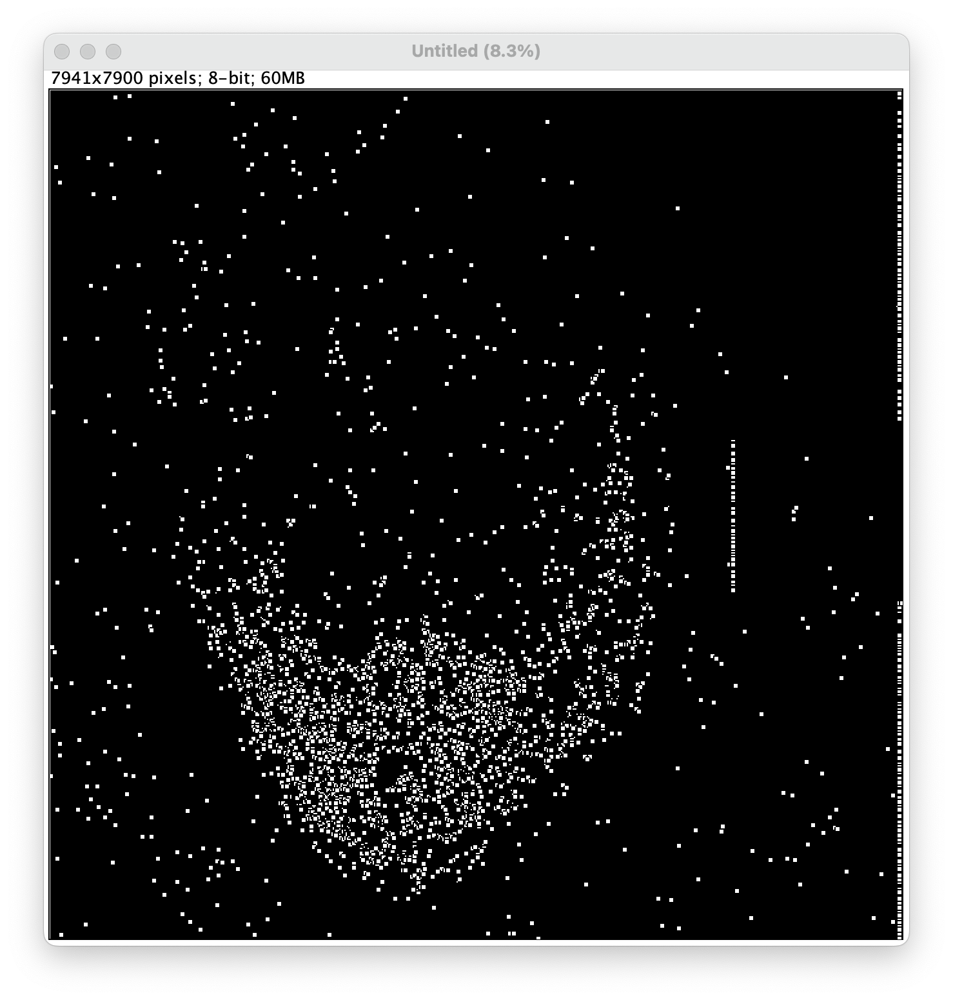

V3 HCR-FISH dot identification with RS-FISH
================

- <a href="#overview" id="toc-overview">Overview</a>
- <a href="#image-pre-processing" id="toc-image-pre-processing">Image
  pre-processing</a>
- <a href="#rs-fish-fiji-plugin-to-identify-dots"
  id="toc-rs-fish-fiji-plugin-to-identify-dots">RS-FISH FIJI plugin to
  identify dots</a>
  - <a href="#setting-parameters-in-interactive-mode"
    id="toc-setting-parameters-in-interactive-mode">Setting parameters in
    interactive mode</a>
  - <a href="#dot-detection-in-advanced-mode"
    id="toc-dot-detection-in-advanced-mode">Dot detection in advanced
    mode</a>
  - <a href="#creating-maxima-image" id="toc-creating-maxima-image">Creating
    maxima image</a>
- <a href="#references" id="toc-references">References</a>

## Overview

This pipeline is designed to provide single-cell resolution gene
expression data to the qualitative, visual data generated by v3
HCR-FISH. The FIJI plugin “RS-FISH” is used to identify dots, which are
turned into single-pixel maxima.

## Image pre-processing

After imaging you should have already processed the direct images with
AiryScan processing, stitching, and max intensity projection. Then you
will need to divide your processed whole-tissue, four-channel image to
separate out tissue of interest (blastema, epithelium, and mesenchyme,
for example) as well as split the channels to run RS-FISH on. [The
instructions for doing this are here](./Tissue_Isolation.md).

## RS-FISH FIJI plugin to identify dots

The RS-FISH FIJI plugin identifies dots in each of the fluorescent
channels from your FISH images. By now, you should have a `.tif` for
each of these channels, as well as a cytoplasm and/or nuclear channel.
The instructions to install the RS-FISH plugin are [available on the
GitHub page](https://github.com/PreibischLab/RS-FISH).

Once RS-FISH is installed, open one of your fluorescent images. For the
sake of this tutorial, it would be best to open one that has decently
high expression and signal. If your image looks like the one below, this
is not a problem - RS-FISH will still be able to detect dots. For ease
of setting parameters and determining if the dots are reasonable, it’s
okay to adjust the brightness and contrast (**without** hitting `Apply`,
which will change the pixel intensity values!). Do this by going to
`Image > Adjust > Brightness/Contrast...` and use the slider bars or
`Set` to find good values.

#### Setting parameters in interactive mode

With your image open, go to `Plugins > RS-FISH > RS-FISH`. This will
open a box titled `Radial Symmetry (2d/3d)`:

For right now, everything on this screen can be left as-is, except that
you should tick the box that says `Add detections to ROI-Manager`. If
you have multiple images open, make sure the `Image` drop-down box is
displaying the file you intend to work with. Hit `OK`.

A few new windows will pop up. One is your `Log`, which you can ignore
for right now. Another is titled `Adjust difference-of-gaussian values`,
and a third says `Adjust RANSAC values`. The final one is the same size
as your input image, titled `RANSAC preview`. If you look at your
original image, you’ll see that, like in the `RANSAC preview`, there’s a
small rectangle drawn on:

This rectangle is a test area where the predicted dots will show up as
you adjust your parameters. If it’s too small, or not in an area where
there are enough dots to be useful, you can go into the main FIJI bar
and select the `Rectangle` tool. You can zoom in and move around on your
image to find a good area, then redraw the rectangle where you want. It
will automatically adjust in the `RANSAC preview` window too. You may
already see some dots being picked up in this window.

Now to dive into the parameters. Again, you can read more about them and
what they do [on the RS-FISH Github
page](https://github.com/PreibischLab/RS-FISH). They also walk through
everything I’ve discussed above and the rest of what is covered
regarding the plugin’s use, so you can also follow along their tutorial
if you prefer.

In the `Adjust difference-of-gaussian values` window, you’ll see
`Sigma = 1.50` and `Threshold = 0.0070` with sliding bars underneath.
These are arbitrary starting values, and are often too strict for what
we want to do.

- Sigma is essentially the expected size of a dot, and can change
  between channels or fluorophores. Use your judgment. Zoom in on your
  image to see how to diameter of detected dots changes as you slide the
  bar to find a value that seems fitting.

- Threshold is the cutoff for signal intensity using difference of
  Gaussian. As you slide the bar to the left (lower threshold), you’ll
  notice more and more dots detected. Again use your judgment to find a
  value that looks like only real signal is being picked up, while
  background is ignored.

In the `Adjust RANSAC values` window, you’ll see additional sliding bars
and an option for background subtraction. I won’t go into detail about
these, but you can read about them in the RS-FISH documentation, and
play around with them as you see fit. For now, it’s also okay to leave
them as-is, with `No background subtraction` selected. Hit `Done` in
either of these boxes.

You’ll see your `Log` start to run through the steps of RS-FISH, and a
histogram will pop up like this:

The blue line is another threshold. If a dot’s pixel intensity falls
below that threshold, it gets excluded from the final results. Depending
on your imaging setup, this threshold could vary quite a bit. We’ve
found that best practice is to set this at `0` to avoid introducing
subjectivity; however, potentially due to AiryScan processing, it seems
that `10000` can actually be a “true” 0 value for many images. Set your
cutoff at an appropriate value, then click `OK`.

RS-FISH will do its calculations reported in the `Log`, then two screens
will pop up. One is a file of the detected dots’ coordinates, which you
can save if you want, but they won’t be used further. The other is the
`ROI Manager`. Here every dot is assigned an ROI number. If the ROI
Manager doesn’t pop up, you need to go back and tick the box that says
`Add detections to ROI-Manager` in the RS-FISH opening screen before
running RS-FISH again.

In the ROI Manager, click `Properties...`, then change `Point type:` to
`Dot`. You can also change the default color if needed to aid
visualization. Click `OK` and apply to all selections. Then check the
box that says `Show All`, and the detected dots will show up overlaid on
your image: 

Zoom in and out, toggling `Show All` to assess whether your parameters
were set well. If a lot of dots are being missed, or a lot of background
is being picked up on, you’ll need to go back and adjust them. If it
looks good, you can move forward below.

#### Dot detection in advanced mode

You can exit out of the `ROI Manager` and `smFISH Localizations` boxes
from Interactive mode, discarding the dots that were found. Reopen
RS-FISH with `Plugins > RS-FISH > RS-FISH`. In the screen that pops up,
change the `Mode` from `Interactive` to `Advanced`. Also make sure
`Add detections to ROI-Manager` is ticked. Hit `OK`.

A screen will open like this:

If you came directly from `Interactive` mode without closing FIJI, this
will be pre-populated with the most recent parameters you set. Here you
can adjust as necessary, maybe making the `Spot intensity threshold`
exactly `0` or `10000`, and refining the other parameters as desired.
Make a note of what values you set if you intend to use them on other
images. Hit `OK`.

Once again, when the calculations are finished, the `ROI Manager` will
open with your detected dots. Change the point type to `Dot`, and size
to `Small`. The color doesn’t matter, but my default is `white`. Now you
can move on to the next step of making the Maxima image.

#### Creating maxima image

Without closing the `ROI Manager`, go to `File > New > Image`. Make the
`width` and `height` of the new image the same as the image you were
just working with, and make `Fill with:` black. With this new blank
image selected, tick `Show All` in the ROI Manager. The dots should
overlay on the image like this:

In the ROI Manager window, hit `Flatten`. A new image will open, and it
might look like nothing is there, but if you zoom in you’ll see each of
the dots are just smaller as they are no longer an overlay.

With the flattened image selected, go to `Process > Find Maxima`. Set
your `Prominence` to `0`. Change the `Output type` to `Single Points`,
then hit `OK` and wait a second.

What will open is an image that will probably look blank, either fully
white or fully black - it doesn’t matter which. This is because the dots
detected by RS-FISH have been reduced to single binary pixels, wherein a
“positive” pixel (i.e., a dot) has a value of 255, and every other pixel
(i.e., not a dot) has a value of 0. If you zoom in a lot, you will see
that there are black (or white) pixels where the dots were detected.
Save this image as a `.tif` with `_Maxima.tif` at the end. In this
example,
`10DPA_Distal-DMSO_Cyp26b1-Cyp26a1-Crabp2_Animal5_Whole_Tissue_Crabp2.tif`
would become
`10DPA_Distal-DMSO_Cyp26b1-Cyp26a1-Crabp2_Whole_Tissue_Crabp2_Maxima.tif`.

This maxima image is what you will then use to [count dots with an ROI
converter](./ROI_Converters.md).

## References

Bahry, Ella, Laura Breimann, Marwan Zouinkhi, Leo Epstein, Klim
Kolyvanov, Nicholas Mamrak, Benjamin King, et al. 2022. “RS-FISH:
Precise, Interactive, Fast, and Scalable FISH Spot Detection.” Journal
Article. *Nature Methods* 19 (12): 1563–67.
<https://doi.org/10.1038/s41592-022-01669-y>.

Choi, Harry M. T., Maayan Schwarzkopf, Mark E. Fornace, Aneesh Acharya,
Georgios Artavanis, Johannes Stegmaier, Alexandre Cunha, and Niles A.
Pierce. 2018. “Third-Generation in Situ Hybridization Chain Reaction:
Multiplexed, Quantitative, Sensitive, Versatile, Robust.” Journal
Article. *Development* 145 (12): dev165753.
<https://doi.org/10.1242/dev.165753>.

