Image pre-processing and specifying areas of interest
================

- <a href="#overview" id="toc-overview">Overview</a>
- <a href="#steps" id="toc-steps">Steps</a>
  - <a href="#inspecting-your-image"
    id="toc-inspecting-your-image">Inspecting your image</a>
  - <a href="#split-the-image-channels-in-multi-channel-images"
    id="toc-split-the-image-channels-in-multi-channel-images">Split the
    image channels in multi-channel images</a>
  - <a href="#isolate-areas-of-interest-using-the-freehand-tool"
    id="toc-isolate-areas-of-interest-using-the-freehand-tool">Isolate areas
    of interest using the freehand tool</a>
    - <a href="#further-example" id="toc-further-example">Further example</a>
  - <a href="#resulting-output" id="toc-resulting-output">Resulting
    output</a>
- <a href="#references" id="toc-references">References</a>

### Overview

Below you will find the steps that need to be run for each of your raw
images to spatially isolate tissues into different areas of interest. It
will make your life a lot easier down the line if files are named
consistently, including capitalization, and without spaces or special
characters.

**DO NOT** crop your images or otherwise change their dimensions when
working with multiple tissues from an original image (zooming in and out
is fine). This will impact how the coordinates of the segmentation
results line up with the cells and nuclei in the image.

### Steps

In this example, I’ll be starting with
`10DPA_Proximal_DMSO_Raldh1_Raldh2_Raldh3_Animal5.czi`. After a
three-gene v3 HCR-FISH (Choi et al. 2018) with a DAPI nuclei stain, this
image was taken on a Zeiss LSM 880 with 4 channels, 5 z-planes, and
tiling. Prior to this current step, the image was Airyscan processed on
the ZenBlack software, then a maximum intensity projection was performed
and the tiles stitched to produce a single-plane, four-channel image.

#### Inspecting your image

1.  Open the image with FIJI (Schindelin et al. 2012). If a screen pops
    up with `Bio-Formats Import Options` at the top, change the settings
    to match these exactly:

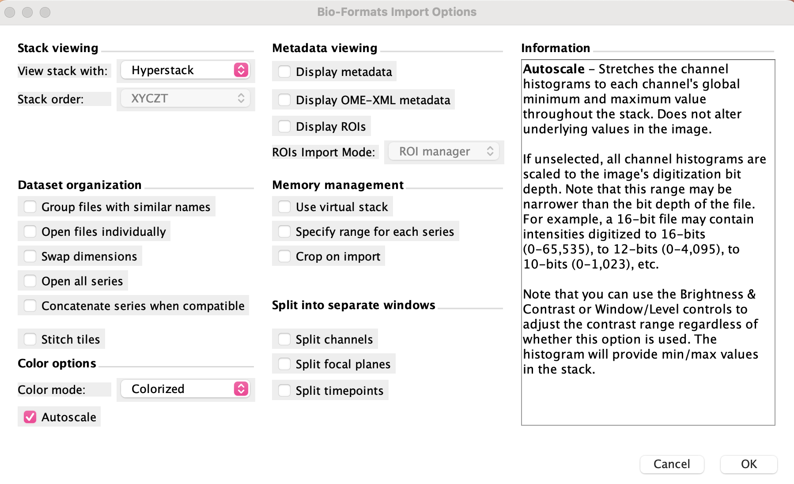

2.  Click `OK`. You can ignore any warning messages that pop up in the
    `Console` window. The colors might not be very bright, and that’s
    okay. You can adjust the brightness for visualization with the
    `Image > Adjust > Brightness & Contrast` window in FIJI. **DO NOT**
    click `Apply` - this will change the actual pixel intensities.

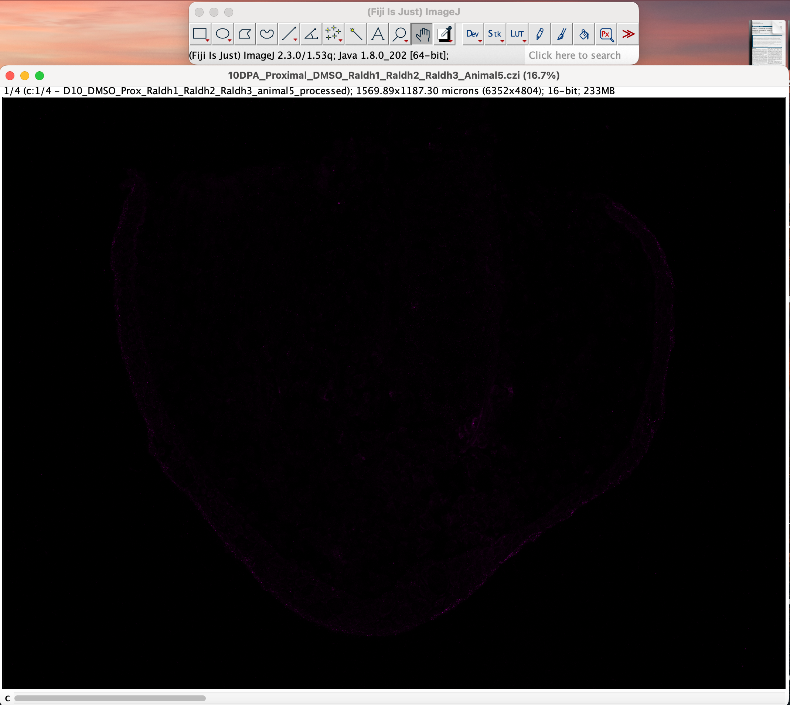

3.  Using the scroll bar below the image, look for any issues with
    stitching. This should be pretty apparent in the cytoplasm or
    nuclear stain channel, and will appear as a seam on the image like
    this:

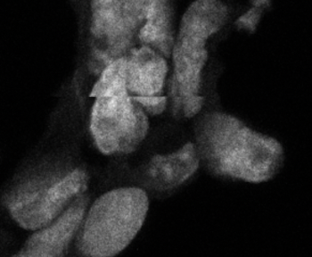

If you see this, do not go further with this image; it will need to be
re-stitched unless the stitching error is not on the tissue, especially
in the areas you are interested in. If you encounter the following
“walls of color” with or without evident seams like below, this is **not
a problem** again if the bad stitch is not on the tissue (note the faint
tile boundaries in the right-center tile):

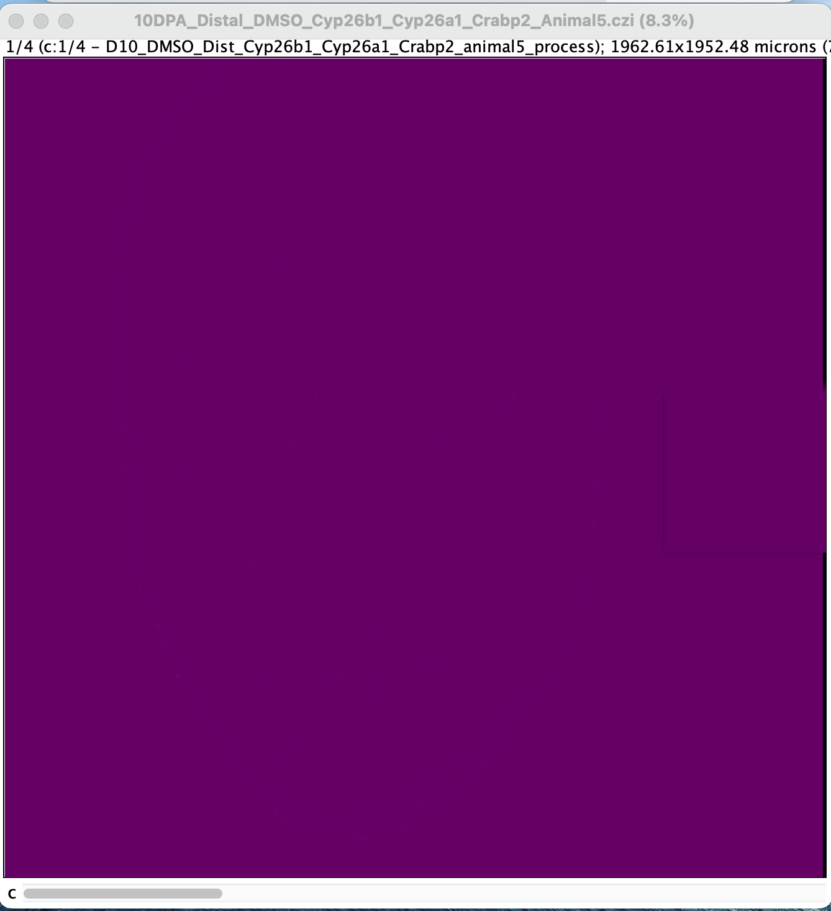

#### Split the image channels in multi-channel images

4.  Split the image channels:

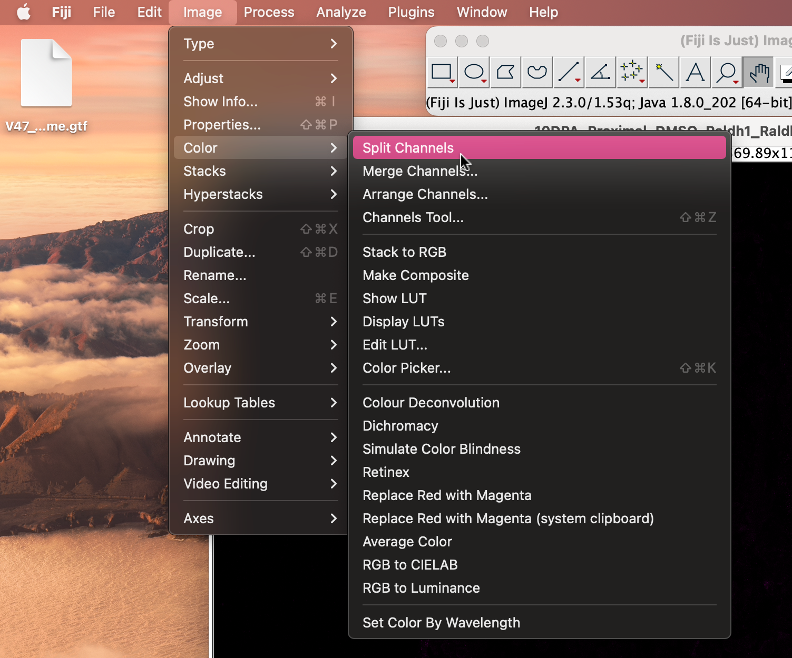

You should end up with several new image windows, each of a different
color channel. Here are some side-by-side (edited to show up brighter):

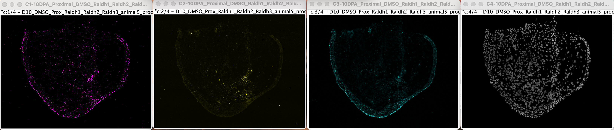

5.  Save each window from step 4 as a new `.tif`
    (`File > Save As > Tiff...`). Name each of these images with the
    original file name,
    e.g. `10DPA_Proximal_DMSO_Raldh1_Raldh2_Raldh3_Animal5`, but add
    `_Whole_Tissue_GeneName.tif` at the end. FIJI will add a channel
    number like `C1-` to the beginning of each file, so be sure to
    delete this too. `GeneName` should align with whatever gene was
    imaged in that channel, chosen before starting HCR-FISH.

If you forget which color aligns with which channel, look in the top
left corner of the image. There should be an indication of `1/4`, `2/4`,
`3/4`, or `4/4`:

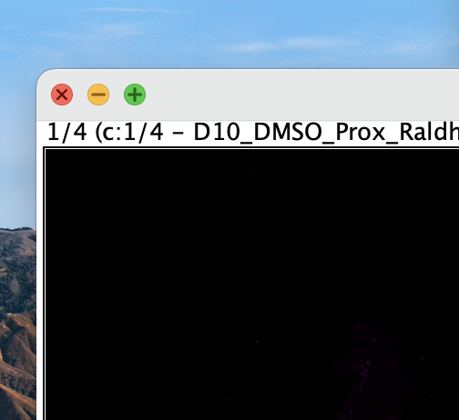

These correspond to the channels, which happen to be the gene names in
order. In this example, with
`10DPA_Proximal_DMSO_Raldh1_Raldh2_Raldh3_Animal5.czi`, this means that
`1/4` is `Raldh1`, `2/4` is `Raldh2`, `3/4` is `Raldh3`, and `4/4` is
`DAPI`.

**At the end of step 5** you should now have one new `.tif` file for
each channel of your original image. In this example, they are:

- `10DPA_Proximal_DMSO_Raldh1_Raldh2_Raldh3_Animal5_Whole_Tissue_Raldh1.tif`
- `10DPA_Proximal_DMSO_Raldh1_Raldh2_Raldh3_Animal5_Whole_Tissue_Raldh2.tif`
- `10DPA_Proximal_DMSO_Raldh1_Raldh2_Raldh3_Animal5_Whole_Tissue_Raldh3.tif`
- `10DPA_Proximal_DMSO_Raldh1_Raldh2_Raldh3_Animal5_Whole_Tissue_DAPI.tif`

Close all of these except for the image corresponding to your nuclei or
cytoplasm stain.

#### Isolate areas of interest using the freehand tool

6.  Using the freehand selection tool in FIJI, draw around one area of
    the tissue you are interested in, trying your best to avoid cutting
    through cells / nuclei. In the example below, I am isolating
    blastemal tissue at the amputation plane, as we don’t care about
    what’s happening outside of the blastema.
    
    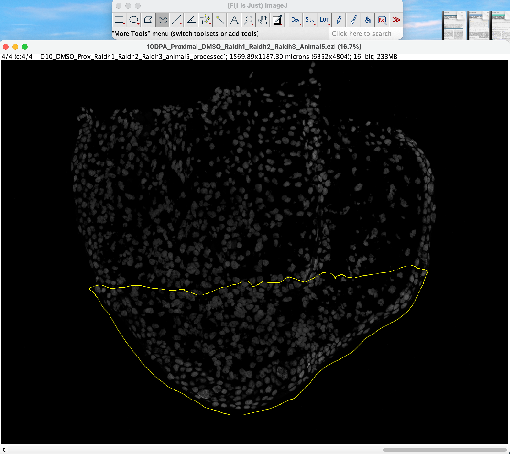

7.  Click `Edit` -\> `Clear Outside` to remove anything outside of this
    boundary.
    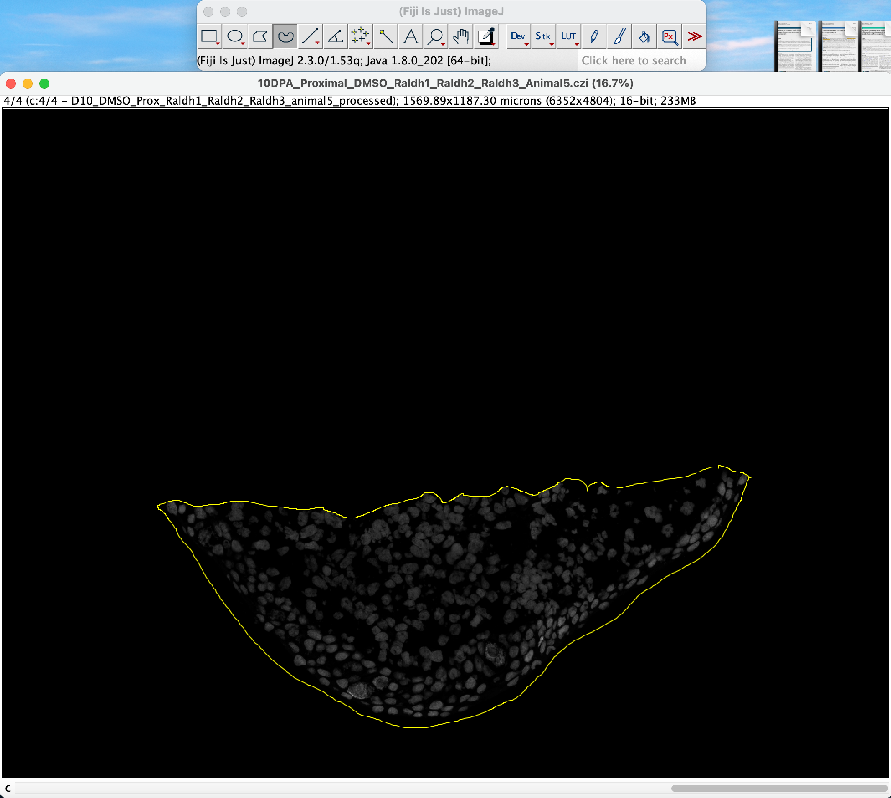

8.  **Save this image** as a **new** `.tif` with the original file name,
    but add `_{Tissue}_{Stain}.tif` to the end, where `Tissue` is
    whatever area the selection was and `Stain` being the cytoplasm or
    nuclear stain used. In this example, this is
    `10DPA_Proximal_DMSO_Raldh1_Raldh2_Raldh3_Animal5_Blastema_DAPI.tif`.
    If you would like to then isolate further areas, you can go to
    `Edit > Undo` and the tissue outside of the boundary will reappear -
    the image you saved previously will still have the tissue isolated.
    You can then redo this step as many times as desired, drawing a
    selection around different tissues of interest and clearing the
    remaining tissue, saving the specific tissue files as you go along.
    If your tissue of interest is, for example, everything **but** what
    you just isolated, and your selection boundary is gone, you can go
    to `Edit > Selection > Restore Selection`, and then `Edit > Clear`.
    An example of this is below with two other tissues we are interested
    in in the blastema.

##### Further example

9.  Using the freehand tool, draw along the inner edge of the epithelium
    and around the mesenchyme:
    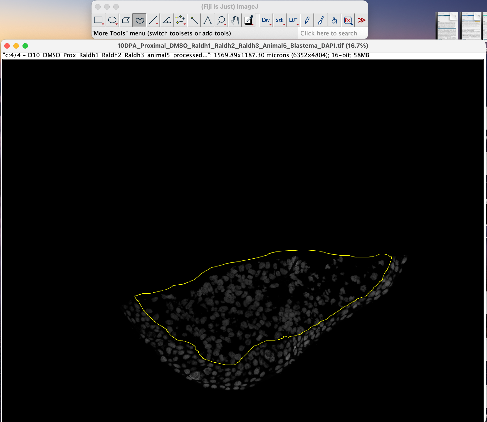

10. Use `Clear Outside`, then save this image as a new `.tif` with the
    original file name, adding `_Mesenchyme_DAPI.tif` to the end.

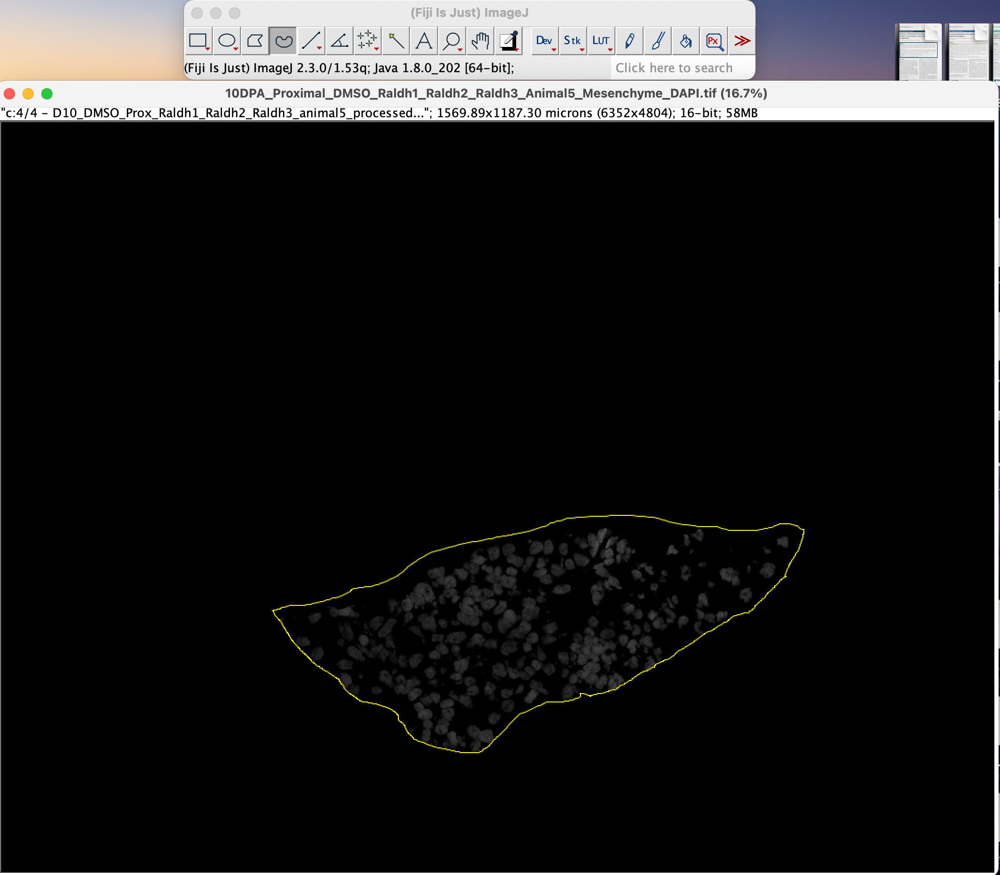

In this example, this is
`10DPA_Proximal_DMSO_Raldh1_Raldh2_Raldh3_Animal5_Mesenchyme_DAPI.tif`.

11. Use `Edit > Undo`, then use `Clear`. Save this as a new `.tif`, with
    `_Epithelium_DAPI.tif`.

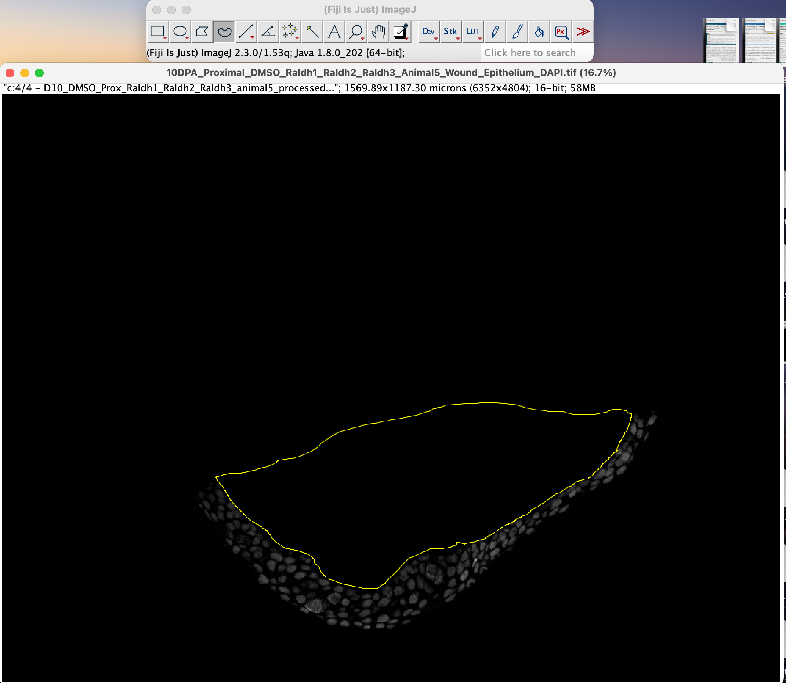

In this example, this is
`10DPA_Proximal_DMSO_Raldh1_Raldh2_Raldh3_Animal5_Epithelium_DAPI.tif`.

#### Resulting output

After all of these steps, you should now have the following images:

1.  The **original** unaltered image in `.czi` format. There will be
    nothing further done with this image, so you can store it somewhere
    and otherwise forget about it :-)

- Ex: `10DPA_Proximal_DMSO_Raldh1_Raldh2_Raldh3_Animal5.czi`.

2.  New `Whole_Tissue` images, one per channel from the original image,
    in `.tif` format.

- `10DPA_Proximal_DMSO_Raldh1_Raldh2_Raldh3_Animal5_Whole_Tissue_DAPI.tif`
- `10DPA_Proximal_DMSO_Raldh1_Raldh2_Raldh3_Animal5_Whole_Tissue_Raldh1.tif`
- `10DPA_Proximal_DMSO_Raldh1_Raldh2_Raldh3_Animal5_Whole_Tissue_Raldh2.tif`
- `10DPA_Proximal_DMSO_Raldh1_Raldh2_Raldh3_Animal5_Whole_Tissue_Raldh3.tif`

3.  New images of each isolated tissue you are interested in, in `.tif`
    format.

- `10DPA_Proximal_DMSO_Raldh1_Raldh2_Raldh3_Animal5_Blastema_DAPI.tif`
- `10DPA_Proximal_DMSO_Raldh1_Raldh2_Raldh3_Animal5_Mesenchyme_DAPI.tif`
- `10DPA_Proximal_DMSO_Raldh1_Raldh2_Raldh3_Animal5_Epithelium_DAPI.tif`

### References

Choi, Harry M. T., Maayan Schwarzkopf, Mark E. Fornace, Aneesh Acharya,
Georgios Artavanis, Johannes Stegmaier, Alexandre Cunha, and Niles A.
Pierce. 2018. “Third-Generation in Situ Hybridization Chain Reaction:
Multiplexed, Quantitative, Sensitive, Versatile, Robust.” Journal
Article. *Development* 145 (12): dev165753.
<https://doi.org/10.1242/dev.165753>.

Schindelin, Johannes, Ignacio Arganda-Carreras, Erwin Frise, Verena
Kaynig, Mark Longair, Tobias Pietzsch, Stephan Preibisch, et al. 2012.
“Fiji: An Open-Source Platform for Biological-Image Analysis.” Journal
Article. *Nature Methods* 9 (7): 676–82.
<https://doi.org/10.1038/nmeth.2019>.

